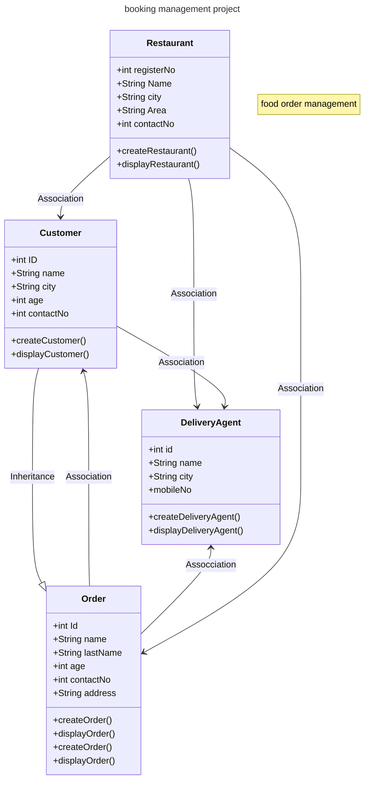

# spring-boot-booking-management-project

spring-boot-booking-management-project

## Table of Contents

- [Introduction](#introduction)
- [Features](#features)
- [Technologies Used](#technologies-used)
- [Getting Started](#getting-started)
- [Installation](#installation)
- [Usage](#usage)
- [Spring Annotation](#SpringAnnotation)
- [Code Structure](#CodeStructure)
- [Database Schema (POJO Classes)](DatabaseSchema)
- [Class Diagram](ClassDiagram)
- [Contributing](#contributing)
- [Contact](#contact)
- [Author](Author~ShreyaMahalle)
- [License](#license)

# **spring-booking-management-project**

Welcome to the Spring Booking Management Project, a simple yet powerful Java application that simulates a booking management system. This project is built using the
Spring Framework (XML-based configuration only) and applies solid Object-Oriented Programming (OOP) principles.


## Introduction

## ** Project Overview**

The Spring Booking Management System provides a modular approach to managing:

 - Customers

 - Restaurants

 - Delivery Agents

 - Orders

It mimics real-world operations like customer registration, restaurant assignment, order placing, and delivery
tracking — all managed using a clean layered architecture (Controller → Service → Repository).


---

## Features

## **✨ Key Features**

- ** Customer and Restaurant Booking Management**: Effortlessly handle customer bookings and restaurant data.
- ** Delivery Agent Simulation**: Assign delivery agents based on location and availability.
- ** Dynamic Order Handling**: Add, track, and manage orders through their entire lifecycle.
- ** Seamless Java Integration**: Clean integration of Java models for each entity (Customer, Delivery Agent, Order,
  Restaurant).
- ** Easy-to-Follow Structure**: Well-documented, clean code for learning and demonstration.
- ** Layered Architecture**: Clean separation of concerns.
- ** REST API**: Full CRUD functionality exposed via REST.
---

## 🛠️ Technologies Used

This project is built with the following technologies:


| Technology        | Purpose                                   |
|------------------|-------------------------------------------|
| Java 21           | Core language                            |
| Spring Boot       | Application framework                    |
| Spring Web        | RESTful APIs                             |
| Spring Data JPA   | Database operations                      |
| Hibernate         | ORM mapping                              |
| JSP/Servlets      | Web interface                            |
| MySQL             | Relational database                      |
| Maven             | Project management and build             |
| Lombok            | Boilerplate reduction                    |
| HTML5/CSS3        | Frontend structure                       |
| Git               | Version control                          |

---

## Getting Started

## ** Installation and Setup**

### **Prerequisites**

Before you begin, ensure you have the following:

- **Java Development Kit (JDK) 21**: Install the latest JDK for optimal performance.
- **Maven**: Make sure Maven is installed to handle the project build.
- **MySQL Database**: You'll need to have MySQL installed and set up to manage your data.
- **Apache Tomcat**: A servlet container for running your web application.
- **IDE**: Use IntelliJ IDEA, Eclipse, or any Java IDE you're comfortable with.
- **Git (optional)**: For version control and easier collaboration.

## **Steps to Get Started**

## 1. **Clone the Repository:**

   ```bash
   git clone git@github.com:shreyamahalle/spring-boot-booking-management-project.git
```

## 2. **Navigate to the Project Directory:**

```bash
 cd spring-boot-booking-management-project
```

## 3. **Open the Project in Your Preferred IDE:**

```bash

 Launch your IDE (IntelliJ, Eclipse, etc.), and open the cloned repository.
```

## 4. **Set up the MySQL Database:**

```bash
  CREATE DATABASE booking_management;
  USE booking_management;
```

## 5. **MySQL Database Setup**

- To set up the database and create the necessary tables, run the following SQL queries:
  ```bash
  -Insert sample data into the Customer table
   INSERT INTO Customer (name, username, mobileNo, city, area)
  
  -VALUES ('John Doe', 'johndoe123', '123-456-7890', 'New York', 'Manhattan');
  ```

## 6. **Configure Your MySQL Connection:**

- In your project configuration (application.properties), set the MySQL database connection details.

- Example application.properties:

- spring.datasource.url=jdbc:mysql://localhost:3306/booking_management
- spring.datasource.username=root
- spring.datasource.password=your_password
- spring.datasource.driver-class-name=com.mysql.cj.jdbc.Driver

## 7. **Compile and Run the Application:**

- Locate Main.java in your IDE.

- Run the file to launch the application.

## 8. **Build the project:**

   ```bash
   mvn clean install
   ```

## Usage

- **User Registration:** Navigate to the registration page and create a new account.
- **User Login:** Log in with your credentials to access the application.
- **CRUD Operations:** Perform create, read, update, and delete operations on the data.
- **Session Management:** Manage user sessions effectively.

## Spring Annotations

- **Overview of Spring Annotations
  In this project, Spring annotations replace XML-based configuration for defining beans, enabling easier configuration
  and management of the application. The following annotations are used:

1. @Configuration
   Description: Marks the class as a source of bean definitions for the application context. This is used in place of
   XML configuration files.

2. @ComponentScan
   Description: Tells Spring to scan the specified base package(s) for annotated components (like @Service, @Controller,
   @Repository, etc.) and register them as beans in the Spring context.

3. @Service
   Description: Indicates that a class is a service, which typically holds business logic. It's a specialization of
   @Component.

4. @Repository
   Description: Marks a class as a Data Access Object (DAO), typically used for database-related operations. It also
   provides exception translation.

5. @Controller
   Description: Marks a class as a Spring MVC controller, handling incoming HTTP requests.
6. @Autowired
   Description: Automatically injects the dependencies into the Spring beans. It can be used on fields, constructors, or
   setter methods.
7. @Bean
   Description: Used to define a bean within a @Configuration annotated class. It's a method-level annotation.

## Contact

For any questions or suggestions, feel free to open an issue or contact me directly:

- **GitHub:** [Shreya Mahalle](https://github.com/shreyamahalle)

---

*This README was generated by [Shreya Mahalle](https://github.com/shreyamahalle).*

## License

This project is licensed under the MIT License - see the [LICENSE.md](LICENSE.md) file for details.

## **Code Structure** ## 

## **Packages Structure**

- com.booking.configuration: Contains the configuration files, such as AppConfig.java.
- com.booking.using.shreya: Contains the main application logic (App.java).
- com.booking.using.shreya.model: Includes the model classes:
    - Customer.java
    - DeliveryAgent.java
    - Order.java
    - Restaurant.java
- package names: com.booking.Customer.model
- package names: com.booking.DeliveryAgent.model
- package names: com.booking.Order.model
- package names: com.booking.Restaurant.model
- package names: com.booking.shreya.service

## **Functionality**

1. **Customer**
2. **DeliveryAgent**
3. **Order**
4. **Restaurant**

## **🔧 Core Functionality**

1. Customer Management
   Allows you to create and manage customer information such as name, username, contact details, and address.

2. Delivery Agent Management
   Adds delivery agents, assigns them to orders, and tracks their delivery status.

3. Order Management
   Manages the creation, display, and tracking of customer orders from placement to delivery.

4. Restaurant Management
   Registers new restaurants, displays restaurant details, and associates them with orders.

## **📝 Database Schema (POJO Classes)**

| **Entity**        | **Attributes**                              |
|-------------------|---------------------------------------------|
| **Customer**      | user id, name, username,monbileNo,city,area |
| **DeliveryAgent** | id, name, city, mobileNo                    |
| **Order**         | id, name, city, mobileNo                    |
| **Restaurant**    | registerNo, name, City, Area                |

---

# Class Diagram



---

## 👨‍💻 Author

Shreya Mahalle  
[GitHub](https://github.com/shreyamahalle) | [LinkedIn](https://linkedin.com/in/shreyamahalle)

---

